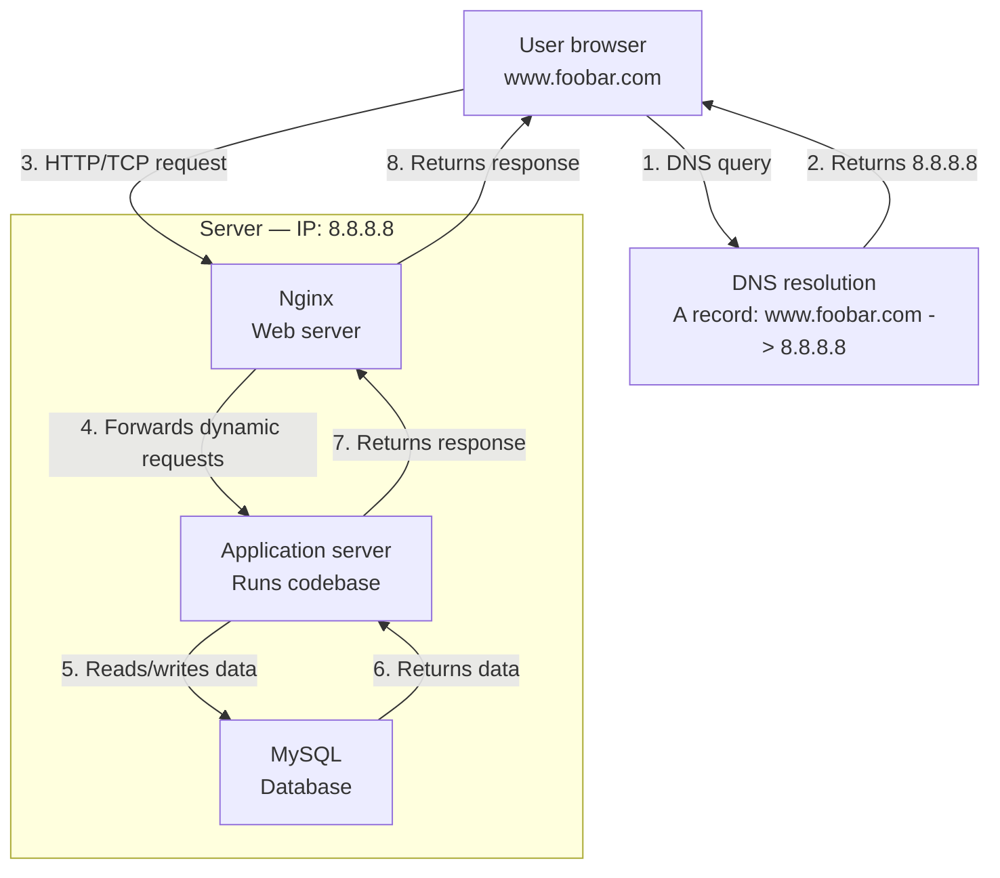

## Infrastructure specifics

**What is a server?**
A server is a physical or virtual machine that provides services or resources to other computers (clients) over a network. Here it hosts all components needed to serve the website.

**What is the role of the domain name?**
The domain name (foobar.com) is a human-readable address that maps to the machine-readable IP address 8.8.8.8. Users type www.foobar.com and DNS handles the translation.

**What type of DNS record is "www" in www.foobar.com?**
It is an A record. It directly maps the hostname www.foobar.com to the IPv4 address 8.8.8.8.

**What is the role of the web server (Nginx)?**
Nginx handles incoming HTTP/HTTPS requests from the user's browser. It serves static files directly and forwards dynamic requests to the application server.

**What is the role of the application server?**
The application server executes the codebase, processes dynamic requests forwarded by Nginx, interacts with the database, and returns responses.

**What is the role of the database (MySQL)?**
MySQL stores and manages the website's persistent data. The application server queries it to read or write data as needed to fulfill requests.

**What protocol does the server use to communicate with the user's computer?**
HTTP (or HTTPS for encrypted communication), which runs over TCP/IP.

## Issues with this infrastructure

**SPOF (Single Point of Failure):**
Everything runs on one server. If it goes down, the entire website becomes unavailable. There is no redundancy or failover.

**Downtime when maintenance is needed:**
Deploying new code requires restarting Nginx or the application server. Since there is only one server, this causes temporary unavailability during restarts or updates.

**Cannot scale if too much incoming traffic:**
A single server has finite CPU, RAM, and bandwidth. If traffic spikes beyond capacity, performance degrades and requests may fail. There is no way to horizontally scale by adding more servers.
