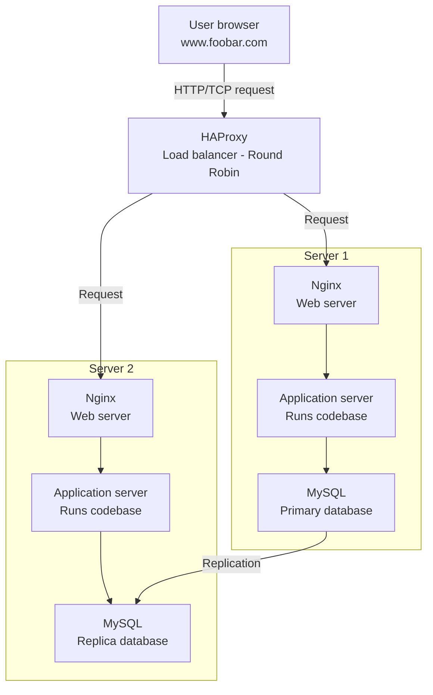

## Why each element was added

**2 servers:**
Adding a second server eliminates the single point of failure from a one-server setup. If one server goes down, the other continues serving traffic. It also allows load to be distributed across both machines.

**HAProxy load balancer:**
HAProxy sits in front of both servers and distributes incoming requests between them. Without it there is no way to route traffic intelligently across multiple servers. It acts as the single entry point for all user requests.

**Primary-Replica database setup:**
One MySQL instance is the Primary and the other is the Replica. This improves data availability and read performance, and provides a backup in case the primary database fails.

## Infrastructure specifics

**What distribution algorithm is HAProxy configured with and how does it work?**
HAProxy is configured with Round Robin. It sends each incoming request to the next server in the list, cycling through them equally. Request 1 goes to Server 1, request 2 goes to Server 2, request 3 goes back to Server 1, and so on.

**Is the load balancer enabling an Active-Active or Active-Passive setup?**
Active-Active. Both servers are running and handling live traffic simultaneously. In an Active-Passive setup, one server sits idle on standby and only takes over if the active one fails. Active-Active is more efficient but requires the application to handle requests landing on either server.

**How does a Primary-Replica database cluster work?**
The Primary node handles all write operations (INSERT, UPDATE, DELETE). Every write is then replicated to the Replica node. The Replica stays synchronized and can handle read queries to reduce load on the Primary. If the Primary fails, the Replica can be promoted to take over.

**What is the difference between the Primary and Replica node from the application's perspective?**
The application sends all write queries to the Primary node. Read queries can be directed to the Replica to distribute load. The Replica is read-only from the application's perspective — writing to it directly would break replication consistency.

## Issues with this infrastructure

**SPOF:**
The HAProxy load balancer is itself a single point of failure. If it goes down, no traffic reaches either server even if both are healthy. The Primary database is also a SPOF — if it fails, no writes can be processed until the Replica is manually promoted.

**Security issues (no firewall, no HTTPS):**
There is no firewall, meaning all ports are potentially exposed to the public internet. There is also no HTTPS, so all traffic between users and the load balancer is unencrypted — credentials and sensitive data travel in plaintext and are vulnerable to interception.

**No monitoring:**
There is no monitoring system in place. If a server goes down, a database replication lag builds up, or traffic spikes beyond capacity, there are no alerts or dashboards to detect and respond to the problem.
