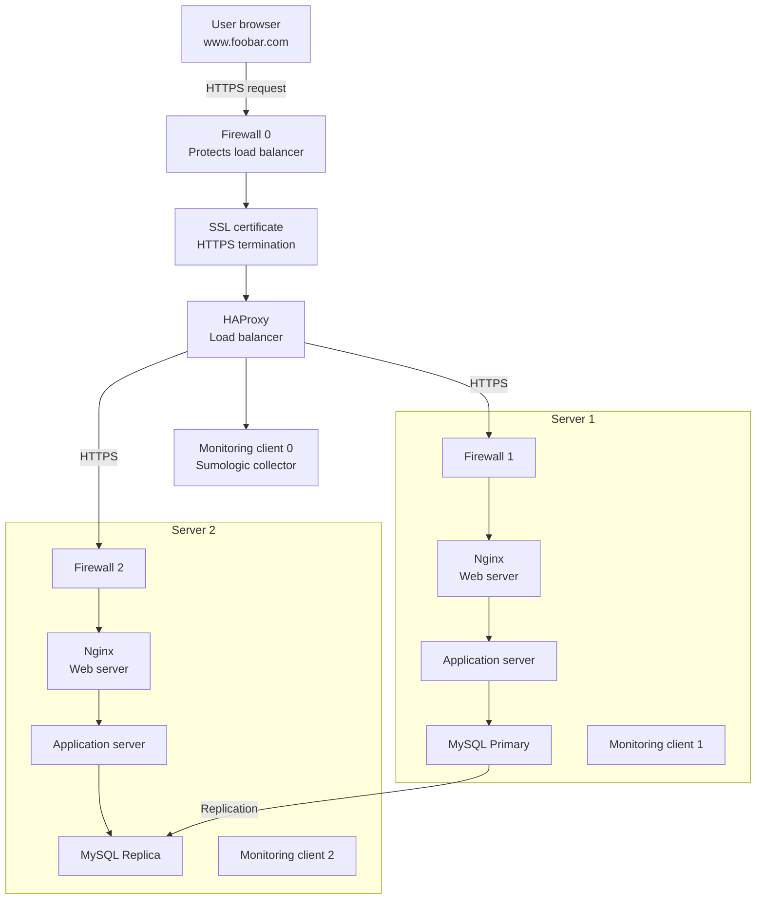

## Why each element was added

**3 firewalls:**
Firewalls filter incoming and outgoing network traffic based on security rules. One protects the load balancer from the public internet, and one protects each server from unauthorized access. They block traffic on ports that should not be publicly accessible (such as the database port).

**SSL certificate:**
The SSL certificate enables HTTPS, encrypting all traffic between the user's browser and the infrastructure. Without it, sensitive data like passwords and session tokens travel in plaintext and can be intercepted.

**3 monitoring clients:**
Monitoring clients collect metrics and logs from each component and send them to a service like Sumologic. This allows the team to detect issues, set up alerts, and respond to problems before users are impacted.

## Infrastructure specifics

**What are firewalls for?**
Firewalls control which network traffic is allowed in and out of a system. They protect servers by blocking unauthorized access and limiting exposure of internal services to the public internet.

**Why is traffic served over HTTPS?**
HTTPS encrypts the connection between the user and the server using TLS. This protects data in transit from interception or tampering, and also verifies to the user that they are talking to the legitimate server.

**What is monitoring used for?**
Monitoring tracks the health, performance, and availability of the infrastructure. It collects metrics like CPU usage, response times, and error rates, and triggers alerts when something goes wrong so engineers can respond quickly.

**How does the monitoring tool collect data?**
Each monitoring client runs as an agent on its server. It collects metrics and logs from the local system and the services running on it, then ships that data to the centralized monitoring service (e.g. Sumologic) over a secure connection.

**What to do if you want to monitor your web server QPS (Queries Per Second)?**
Configure the monitoring client on the server running Nginx to collect and parse the Nginx access logs or use the Nginx stub_status module. Set up a metric in the monitoring service to count incoming requests per second and create a dashboard or alert based on that metric.

## Issues with this infrastructure

**Why terminating SSL at the load balancer level is an issue:**
When SSL is terminated at the load balancer, traffic between the load balancer and the backend servers travels unencrypted. If an attacker gains access to the internal network, they can read all traffic in plaintext. End-to-end encryption would require SSL all the way to each server.

**Why having only one MySQL server capable of accepting writes is an issue:**
If the Primary database goes down, no write operations can be processed until the Replica is manually promoted. This creates both a SPOF for writes and potential data loss during the failover window.

**Why having servers with all the same components might be a problem:**
Running a web server, application server, and database on the same machine means they compete for the same CPU, RAM, and disk resources. A spike in web traffic can degrade database performance, and vice versa. It also makes it harder to scale individual components independently.
