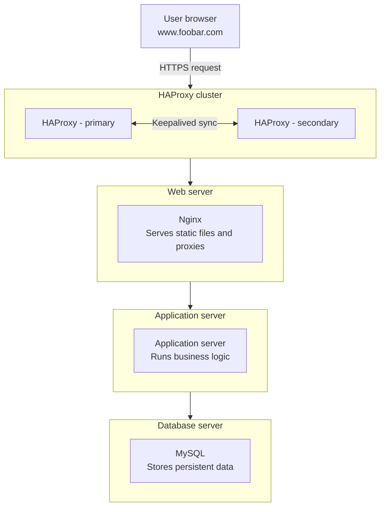

## Why each element was added

**1 additional server:**
Each component (web server, application server, database) now lives on its own dedicated server. Separating them eliminates resource contention — a traffic spike on the web server no longer competes with database queries for CPU and RAM. It also allows each layer to be scaled, maintained, and secured independently.

**HAProxy configured as a cluster with the other load balancer:**
Adding a second HAProxy instance configured as a cluster with the first eliminates the load balancer as a single point of failure. The two instances use Keepalived to share a virtual IP address. If the primary HAProxy goes down, the secondary takes over the virtual IP automatically with no manual intervention and no downtime for users.

**Split components (web server, application server, database) on their own servers:**
Separating components allows each one to be sized and scaled to its own workload. If the application logic becomes the bottleneck, only the application server needs to be scaled up or out. If database read load increases, a replica can be added to the database tier without touching the other servers. This architecture is the foundation for horizontal scaling.
